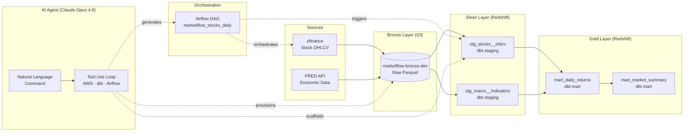

# MarketFlow — AI-Driven Financial Data Platform


> An AI agent that provisions AWS infrastructure, scaffolds dbt models, and generates Airflow DAGs on demand. All from a single natural-language command.

---

## Demo

```bash
$ python main.py "set up the full stocks pipeline for dev"
```

```
╭─ User ───────────────────────────────────────────────────────╮
│ set up the full stocks pipeline for dev                      │
╰──────────────────────────────────────────────────────────────╯

Thinking... (1842 chars)

Tool call: create_s3_bucket
{
  "layer": "bronze",
  "region": "us-east-1"
}
Result: Created bucket: marketflow-bronze-dev (public access blocked)

Tool call: create_s3_bucket
{
  "layer": "silver",
  "region": "us-east-1"
}
Result: Created bucket: marketflow-silver-dev (public access blocked)

Tool call: create_glue_database
{ "layer": "bronze" }
Result: Created Glue database: marketflow_bronze_dev

Tool call: scaffold_dbt_model
{ "layer": "staging", "model_name": "stg_stocks__ohlcv", ... }
Result: Written: dbt/models/staging/stg_stocks__ohlcv.sql

Tool call: generate_airflow_dag
{ "dag_id": "marketflow_stocks_daily", ... }
Result: Written: airflow/dags/marketflow_stocks_daily.py

╭─ Agent ──────────────────────────────────────────────────────╮
│ Pipeline is ready. Created 2 S3 buckets, 1 Glue database,   │
│ 1 dbt staging model, and 1 Airflow DAG. Next: run the       │
│ ingestion script to land raw OHLCV data in bronze.          │
╰──────────────────────────────────────────────────────────────╯
```

---

## Architecture



---

## Tech Stack

| Layer | Tool |
|---|---|
| AI Agent | Claude Opus 4.8 (Anthropic API) with tool use |
| Ingestion | Python + yfinance + FRED API |
| Storage | AWS S3 (Parquet, medallion architecture) |
| Catalog | AWS Glue Data Catalog |
| Warehouse | Amazon Redshift Serverless |
| Transformation | dbt Core |
| Orchestration | Apache Airflow |
| IaC | Terraform |
| Runtime | Python 3.13, uv |

---

## How It Works

The agent is built on **Claude's tool use API**. When you give it a natural-language command, it:

1. Decides which tools to call (S3, Glue, dbt, Airflow)
2. Executes them locally via boto3 / file generation
3. Sends results back to Claude
4. Repeats until the task is complete

```python
# The agent loop in ~10 lines
while True:
    response = client.messages.create(model=MODEL, tools=ALL_TOOLS, messages=messages)
    tool_results = []
    for block in response.content:
        if block.type == "tool_use":
            result = dispatch_tool(block.name, block.input)
            tool_results.append({"type": "tool_result", "tool_use_id": block.id, ...})
    if not tool_results:
        break  # Claude is done
    messages += [assistant_turn, tool_results_turn]
```

---

## Project Structure

```
de_project/
├── main.py                   # CLI entry point
├── agent/
│   ├── agent.py              # Claude tool-use loop
│   └── tools/
│       ├── aws_tools.py      # S3, Glue provisioning
│       ├── dbt_tools.py      # Model + source scaffolding
│       └── airflow_tools.py  # DAG generation
├── ingestion/                # yfinance / FRED extractors
├── dbt/
│   └── models/
│       ├── staging/          # stg_* models
│       ├── intermediate/     # int_* models
│       └── marts/            # mart_* models
├── airflow/dags/             # Generated DAG files
└── infrastructure/           # Terraform (S3, Glue, Redshift)
```

---

## Setup

```bash
# 1. Clone and install
git clone https://github.com/YOUR_USERNAME/marketflow.git
cd marketflow
uv sync

# 2. Configure credentials
cp .env.example .env
# Fill in ANTHROPIC_API_KEY and AWS credentials

# 3. Run the agent
uv run python main.py "provision S3 buckets for dev"
uv run python main.py "scaffold dbt staging models for OHLCV stock data"
uv run python main.py "create a daily Airflow DAG for the stocks pipeline"
```

---

## What I Learned

- Building agentic tool-use loops with the Claude API
- Medallion architecture on AWS (S3 → Glue → Redshift)
- dbt Core project structure (staging → intermediate → marts)
- Airflow DAG authoring and scheduling
- Infrastructure as Code with Terraform
- Scoped IAM permissions for least-privilege access
