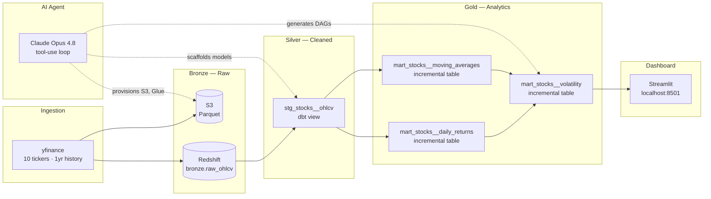
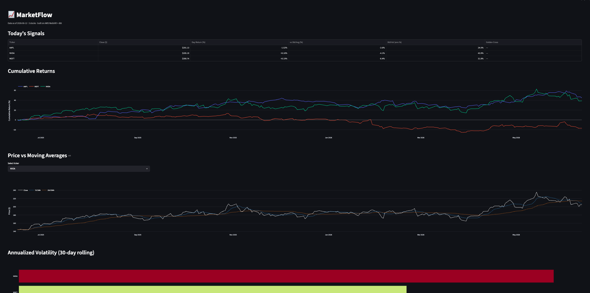

# MarketFlow


A financial data pipeline built on the **medallion architecture** — raw stock prices flow from Yahoo Finance through a bronze → silver → gold transformation layer on AWS, with dbt handling all SQL transformations on Amazon Redshift Serverless. Results are surfaced in a Streamlit dashboard.

An AI agent (Claude Opus 4.8) provisions the infrastructure and scaffolds dbt artifacts from natural-language commands.

---

## What It Does

1. **Ingests** daily OHLCV data for 10 stocks (AAPL, MSFT, NVDA, GOOGL, AMZN, META, TSLA, JPM, BAC, GS) from Yahoo Finance
2. **Lands** raw data in Amazon S3 (parquet) and Redshift (bronze layer)
3. **Transforms** it through two dbt layers — silver cleans and types the data, gold calculates financial metrics
4. **Tests** data quality automatically on every dbt run (20 tests)
5. **Validates** all SQL on every GitHub push via CI
6. **Visualizes** results in a Streamlit dashboard — signals, cumulative returns, moving averages, volatility

---

## Architecture



---

## Dashboard

A Streamlit app reads directly from the Redshift gold tables and renders four views:

- **Today's Signals** — close price, day return %, distance from 30d average, annualized volatility, and golden cross status for all 10 tickers
- **Cumulative Returns** — interactive line chart comparing all stocks since the start of the dataset
- **Price vs Moving Averages** — per-ticker view of close price against 7d and 30d SMA, with ticker selector
- **Volatility Ranking** — horizontal bar chart of 30d annualized volatility across all tickers

```bash
uv run streamlit run dashboard/app.py
# → http://localhost:8501
```



---

## Gold Layer — What the Data Produces

Three analytical tables built in Redshift, updated incrementally on each run:

### `mart_stocks__daily_returns`
Per-ticker daily price movement using a `LAG()` window function.

| column | description |
|--------|-------------|
| `ticker` | Stock symbol |
| `trading_date` | Session date |
| `close_price` | Closing price |
| `price_change` | close − prev_close |
| `daily_return_pct` | Simple return: (close − prev) / prev |
| `daily_log_return` | ln(close / prev_close) — used in vol calculations |

### `mart_stocks__moving_averages`
7-day and 30-day simple moving averages with price-relative ratios.

| column | description |
|--------|-------------|
| `sma_7` | 7-day rolling average of close price |
| `sma_30` | 30-day rolling average of close price |
| `price_to_sma_30` | >1 means price is above its 30d average |

### `mart_stocks__volatility`
Annualized rolling volatility and a golden cross signal — built by joining the two models above.

| column | description |
|--------|-------------|
| `annualized_volatility_30d` | stddev(log_return) × √252 over 30 days |
| `annualized_volatility_7d` | Same over 7 days |
| `golden_cross_signal` | 1 when sma_7 > sma_30 (bullish crossover) |

---

## dbt Project Structure

```
dbt/
├── models/
│   ├── staging/
│   │   ├── stg_stocks__ohlcv.sql             # Silver: clean + type raw OHLCV
│   │   ├── _stg_stocks__ohlcv.yml            # Schema tests: not_null, unique
│   │   └── _bronze_stocks.yml                # Source declaration
│   └── marts/
│       ├── mart_stocks__daily_returns.sql    # Gold: LAG-based daily returns
│       ├── mart_stocks__moving_averages.sql  # Gold: 7d/30d SMA
│       ├── mart_stocks__volatility.sql       # Gold: annualized vol + signals
│       └── _mart_stocks__daily_returns.yml  # Schema + uniqueness tests
└── tests/
    └── assert_daily_return_within_bounds.sql # Custom: flags >50% daily moves
```

All gold models use `materialized='incremental'` with `unique_key=['ticker', 'trading_date']` — on re-runs, only new dates are processed and merged in.

---

## AI Agent

An agentic loop built on Claude's tool use API. You give it a natural-language command; it decides which tools to call, executes them locally, and loops until the task is done.

```bash
uv run python main.py "provision S3 buckets and Glue databases for dev"
uv run python main.py "scaffold a dbt staging model for OHLCV stock data"
uv run python main.py "create a daily Airflow DAG for the stocks pipeline"
```

```
Tool call: create_s3_bucket        → Created: marketflow-bronze-dev
Tool call: create_s3_bucket        → Created: marketflow-silver-dev
Tool call: create_glue_database    → Created: marketflow_bronze_dev
Tool call: scaffold_dbt_model      → Written: dbt/models/staging/stg_stocks__ohlcv.sql
Tool call: generate_airflow_dag    → Written: airflow/dags/marketflow_stocks_daily.py
```

The tool-use loop in ~10 lines:

```python
while True:
    response = client.messages.create(model=MODEL, tools=ALL_TOOLS, messages=messages)
    tool_results = []
    for block in response.content:
        if block.type == "tool_use":
            result = dispatch_tool(block.name, block.input)
            tool_results.append({"type": "tool_result", "tool_use_id": block.id, "content": result})
    if not tool_results:
        break  # Claude returned a text response — done
    messages += [assistant_turn, tool_results_turn]
```

---

## Tech Stack

| Concern | Tool |
|---------|------|
| Ingestion | Python · yfinance · boto3 · redshift_connector |
| Storage | Amazon S3 (Parquet) |
| Data catalog | AWS Glue Data Catalog |
| Warehouse | Amazon Redshift Serverless |
| Transformation | dbt Core · dbt-redshift |
| Data quality | dbt schema tests · singular SQL tests |
| Orchestration | Apache Airflow (DAG definition) |
| Dashboard | Streamlit · Plotly |
| CI | GitHub Actions · SQLFluff · dbt parse |
| AI agent | Claude Opus 4.8 · Anthropic Python SDK |
| Runtime | Python 3.13 · uv |

---

## Setup

```bash
# 1. Clone and install
git clone https://github.com/andresvzb/marketflow.git
cd marketflow
uv sync

# 2. Configure credentials
cp .env.example .env
# Fill in: ANTHROPIC_API_KEY, AWS keys, Redshift connection

# 3. Load raw data into Redshift
uv run python -m ingestion.load_to_redshift

# 4. Run dbt transformations
export $(grep -v '^#' .env | xargs)
uv run dbt deps --project-dir dbt
uv run dbt run --project-dir dbt --profiles-dir ~/.dbt
uv run dbt test --project-dir dbt --profiles-dir ~/.dbt

# 5. Run the dashboard
uv run streamlit run dashboard/app.py

# 6. (Optional) Run the AI agent
uv run python main.py "provision S3 buckets for dev"
```

---

## What I Learned

- **Medallion architecture** — separating raw (bronze), cleaned (silver), and analytical (gold) data into distinct layers with clear contracts between them
- **dbt Core** — source declarations, staging vs. mart model patterns, incremental materialization with merge strategy, schema tests and custom singular tests
- **Window functions** — `LAG()` for period-over-period comparisons, `AVG() OVER (ROWS BETWEEN ...)` for rolling averages, `STDDEV()` for volatility
- **Incremental processing** — only computing new rows on each run, pulling back an extra window so rolling calculations have enough history
- **Redshift quirks** — reserved words (`open`, `close`, `date`) must be double-quoted; `ln()` requires explicit `FLOAT` cast on `DECIMAL` inputs
- **Agentic tool use** — building the request/tool_call/tool_result loop with the Claude API
- **CI for data pipelines** — using `dbt parse` for connection-free SQL validation; configuring SQLFluff with the jinja templater for dbt projects
